# Repetition Lecture Notes — ASD (Agil Mjukvaruutveckling och Driftsättning)

These are the lecture notes used as input for the repetition presentation (`repetition-asd.html`). They summarize the key topics covered during the ASD course, with particular emphasis on areas addressed in the assignment.

---

## The Big Picture — Three Distinct Parts

The setup is usually divided into three very distinct parts:

1. **Left side — Development environment (Inner Loop):** Developers work locally, iterating on code in the inner loop, which eventually ends up in a Git repository on GitHub.
2. **Middle — CI/CD Pipeline:** From GitHub, an automated CI/CD pipeline transports the application code through testing, building, and finally deploying it into a runnable executable artifact.
3. **Right side — Hosting environment:** Classically a virtual machine, but nowadays more often a container platform. This is where the application runs in production.

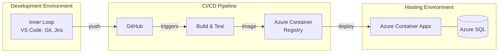

---

## Part 1: Development Process & Methodology

### The Inner Loop

We have gone through the inner loop with Git, GitHub, Jira, and Visual Studio Code. We have emphasized the importance of using Git as both a version control tool and a collaboration tool. Jira, GitHub, and Git are all part of the collaboration within a development team.

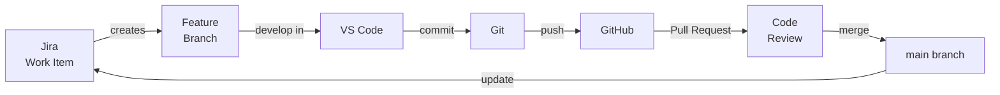

### Product Backlog

The product backlog serves as the interface between the actual development effort and the rest of the company. Sources of change can come from many different places:

- New ideas
- Support tickets
- Bugs found by developers
- Architectural decisions based on technical debt
- Marketing features, usually from the product manager

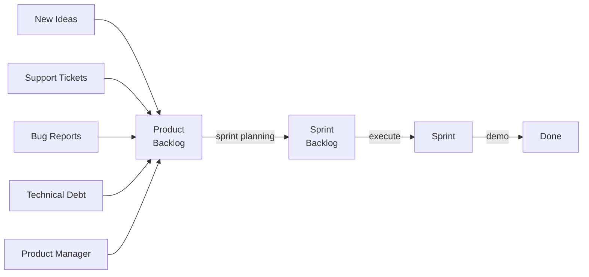

The scope of this course has not been how to handle all sources of incoming ideas for change, but rather that these changes somehow end up in a very structured product backlog with work items that are possible to carry out within one sprint.

### Sprint Planning & Story Points

Sprint planning is usually done with a planning poker game. It is not really about estimating the time a task takes. Rather, it is about estimating the complexity of the task.

- The joint understanding of the degree of complexity over time in the group leads to an understanding of how much complexity one group can carry out within a sprint.
- Story point estimations are only relevant within a development group, not across different groups.
- Accuracy will be quite bad in the beginning, but after a few sprint loops, the estimations start to become much more correct.
- The process is also about communication between developers — where a senior developer might find something very easy while a junior developer sees it as very complex. The discussion leads to a balanced decision on how to understand and carry out the task.

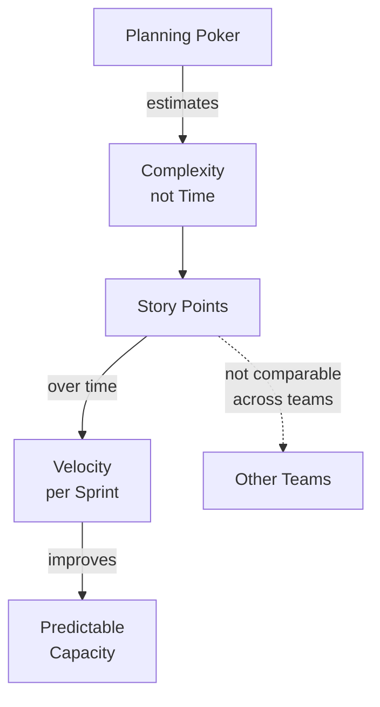

### Git as Collaboration Tool & Record

- Git is both a version control tool and a collaboration tool.
- Git log serves as a record of development, valuable for both developers and AI agents.
- Traceability: through the git hash you can understand exactly what version of the code correlates to the application running in production.

### Pull Requests & Code Review

Pull requests are used for code review and quality assurance. Demo is carried out at the end of each sprint to show what has been delivered and gather feedback.

### Jira–GitHub Integration

The integration between Jira and GitHub provides traceability from work item to code to deployed functionality.

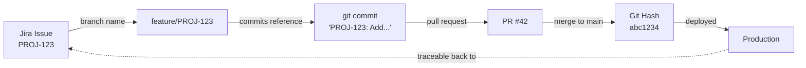

---

## Part 2: Software Design & Architecture

### Everything as Code

We have discussed how important it is to have everything as code:

- The hosting environment is described as code
- The CI/CD pipeline is described as code
- The application itself is described as code

This matters for how you work — everything is traceable, reviewable, and reproducible.

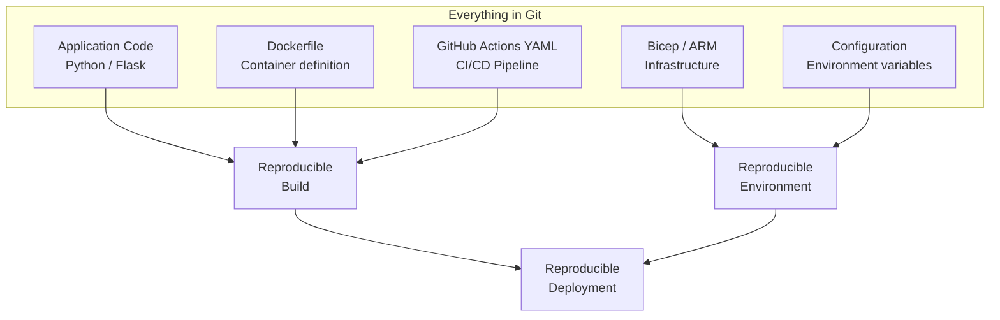

### Three-Tier Application Architecture

When we created the Python Flask application, we applied a three-tier architecture — a very common pattern:

1. **Presentation layer** — using the classic Model-View-Controller (MVC) pattern
2. **Business logic layer** — services handling the application's core logic
3. **Data layer** — using the Repository Pattern on top of SQLAlchemy

```mermaid
graph TD
    CLIENT[Client / Browser] -->|HTTP Request| PRES

    subgraph PRES["Presentation Layer"]
        ROUTES[Routes / Blueprints]
        TEMPLATES[Jinja2 Templates]
    end

    subgraph BIZ["Business Logic Layer"]
        SERVICES[Services]
    end

    subgraph DATA["Data Layer"]
        REPO[Repository Pattern]
        SA[SQLAlchemy ORM]
    end

    PRES -->|calls| BIZ
    BIZ -->|calls| DATA
    DATA -->|queries| DB[(Database)]

    style PRES fill:#1a3a5c,stroke:#0090E3
    style BIZ fill:#3a2a0c,stroke:#FECC00
    style DATA fill:#0a2a1c,stroke:#00D9FF
```

The reason for having this is **separation of concerns**. It is much easier to have many developers working on the same codebase when they can focus on one area without interfering with the others. It also improves maintainability and enables developers to specialize in certain areas.

**Vertical Slice Architecture:** Adding new features can often be carried out by applying a sliced approach where one feature goes through each and every layer and becomes quite independent. This makes it easier for many developers to work on the same feature but with different concerns.

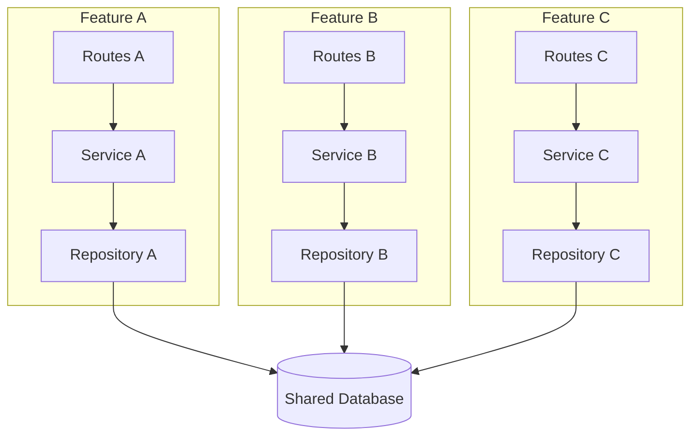

### Design Patterns

- **MVC** in the presentation layer
- **Repository Pattern** in the data layer
- **Application Factory** pattern for creating the Flask app
- **Blueprints** for organizing routes into logical modules

### Configuration Management

Configuration is one of the most error-prone areas in development. Proper handling of configuration is very important.

- A **configuration class** makes it type-safe and centralized
- Environment variables are stored securely in Azure Container Apps
- **12-Factor App principle:** Build once, configure differently per environment. The difference between environments is configuration of environment variables that point the application to different external resources (databases, for instance).
- Locally: SQLite database. Production: Azure SQL. The difference is controlled by environment variables.

```mermaid
graph TD
    CC[Configuration Class<br/>Type-safe, Centralized] -->|reads| ENV[Environment Variables]

    ENV -->|DATABASE_URL| DB_URL{Which DB?}
    DB_URL -->|local| SQLITE[SQLite]
    DB_URL -->|production| AZURE_SQL[Azure SQL]

    ENV -->|SECRET_KEY| SEC[App Secret]
    ENV -->|DEBUG| DBG[Debug Mode]

    style CC fill:#3a2a0c,stroke:#FECC00
```

### Security & Secrets

- Credentials must be handled with care — registered as secrets in the Azure platform, delivered as environment variables to Container Apps
- **OIDC (OpenID Connect):** Federated identity between GitHub and Azure in the CI/CD pipeline, so GitHub can push artifacts to Azure without using stored credentials
- No permanent passwords — short-lived tokens instead

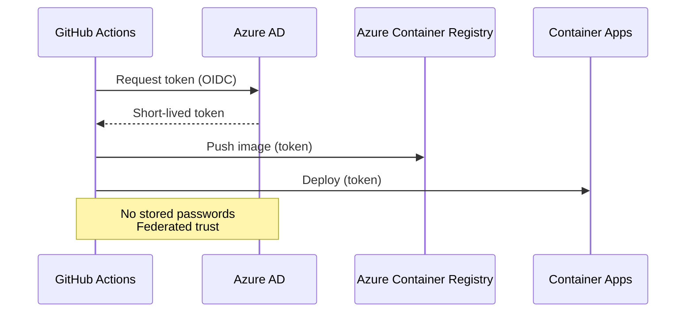

### Docker & Containerization

We introduced briefly the concept of Docker and containerization:

- **Dockerfile** in the Git repository — the recipe that controls what runs in production
- **Docker Image** — the built artifact, stored in Azure Container Registry (ACR)
- **Container** — the running instance in Azure Container Apps

The chain: code in Dockerfile (Git) → Docker Image (ACR) → running container (Container Apps). Everything controlled by code.

```mermaid
graph LR
    DF[Dockerfile<br/>in Git] -->|docker build| IMG[Docker Image<br/>in ACR]
    IMG -->|deploy| CON[Running Container<br/>in Container Apps]

    DF -.->|"Recipe<br/>(code)"| DF
    IMG -.->|"Package<br/>(artifact)"| IMG
    CON -.->|"Instance<br/>(runtime)"| CON

    style DF fill:#1a3a5c,stroke:#0090E3
    style IMG fill:#3a2a0c,stroke:#FECC00
    style CON fill:#0a2a1c,stroke:#00D9FF
```

### CI/CD Pipeline

The CI/CD pipeline uses GitHub Actions to carry out the automated delivery:

1. Code is pushed to GitHub
2. Docker image is built
3. Image is pushed to Azure Container Registry
4. Azure Container Apps is updated with the new image
5. Application connects to Azure SQL Database

OIDC federation is used for passwordless authentication from GitHub to Azure.

```mermaid
graph LR
    PUSH[git push] --> GH[GitHub]
    GH -->|triggers| GA[GitHub Actions]
    GA -->|OIDC login| AZ[Azure]
    GA -->|docker build| IMG[Docker Image]
    IMG -->|push| ACR[Azure Container<br/>Registry]
    ACR -->|deploy| CA[Azure<br/>Container Apps]
    CA -->|connects| DB[(Azure SQL<br/>Database)]

    style GA fill:#3a2a0c,stroke:#FECC00
```

### Build Once, Deploy Many

One of the 12-Factor App principles: you build once and release many times. The same artifact is deployed through multiple environments (System Test, Integration Test, UAT, Stage, Production). What differs is configuration.

Even though we have not had examples of carrying out real tests in the CI/CD pipeline, we have theoretically gone through how a CI/CD pipeline usually involves several testing environments along the way.

```mermaid
graph LR
    BUILD[Build<br/>Docker Image] --> ST[System<br/>Test]
    ST --> IT[Integration<br/>Test]
    IT --> UAT[User Acceptance<br/>Test]
    UAT --> STAGE[Stage]
    STAGE --> PROD[Production]

    ST -.->|config A| ST
    IT -.->|config B| IT
    UAT -.->|config C| UAT
    STAGE -.->|config D| STAGE
    PROD -.->|config E| PROD

    style BUILD fill:#3a2a0c,stroke:#FECC00
    style PROD fill:#0a2a1c,stroke:#00D9FF
```

### Local Development vs. Production

The development setup is quite different from the production hosting environment. Environment variables control how the application behaves in different environments, since you want to build it once but it needs to work in both.

```mermaid
graph TD
    subgraph DEV["Local Development"]
        D1[Flask Dev Server]
        D2[SQLite]
        D3[Debug ON]
        D4[Runs on Laptop]
    end

    subgraph PROD["Production — Azure"]
        P1[Gunicorn WSGI]
        P2[Azure SQL Database]
        P3[Debug OFF]
        P4[Docker Container]
    end

    ENV[Environment Variables] -->|controls behavior| DEV
    ENV -->|controls behavior| PROD

    style DEV fill:#1a3a5c,stroke:#0090E3
    style PROD fill:#0a2a1c,stroke:#00D9FF
```

---

## Part 3: Broader Perspectives

### Starting a New Project

How to initiate a new project from scratch:

1. Understand the task at hand
2. Quickly understand the tech stack — language, frameworks, containerization, database, network, client, tooling
3. The tech stack shapes how you think about the task. Based on increased understanding, you may need to adapt the tech stack, but having a rough estimation early is important.
4. Start with one senior developer or architect who can define a rough architecture from the beginning.
5. This foundation is important for hiring the next layer of developers and eventually a tester.
6. Good team size: about 6 people. Ratio developers to testers: 3:1.

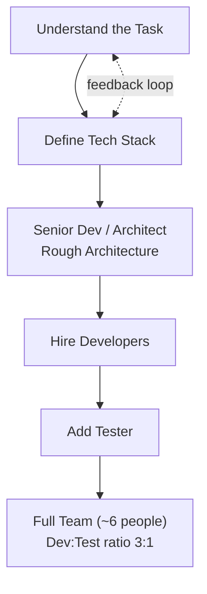

### Tech Stack Choices

Sometimes you choose technologies based on:

- What you already know
- What works for the target audience (e.g., web application)
- Popularity of frameworks — easier to find skilled people
- Developer interest in learning new skills
- Size of the community — more information available to solve problems
- Developer tooling and organizational integration (internet access, security on personal computers)

### Maturity Levels

How to think about maturity levels within the development effort:

1. **Walking Skeleton** — minimal end-to-end architecture proving all parts connect
2. **Minimum Viable Product (MVP)** — smallest product that delivers value and collects feedback
3. **Minimum Marketable Product (MMP)** — ready for the market, requiring non-technical aspects like user instructions, maintenance manuals, support documentation

```mermaid
graph LR
    WS["Walking Skeleton<br/>End-to-end proof"] -->|add value| MVP["MVP<br/>Minimum Viable Product"]
    MVP -->|add polish| MMP["MMP<br/>Minimum Marketable Product"]

    WS -.->|"Technical:<br/>all layers connected"| WS
    MVP -.->|"Delivers value,<br/>collects feedback"| MVP
    MMP -.->|"User manuals,<br/>support docs,<br/>operations guide"| MMP

    style WS fill:#1a3a5c,stroke:#0090E3
    style MVP fill:#3a2a0c,stroke:#FECC00
    style MMP fill:#0a2a1c,stroke:#00D9FF
```

### Refactoring & Technical Debt

- Refactoring is redoing things in a more architecturally sound way and removing technical debt.
- Mature development organizations apply roughly 30% refactoring and 70% new features.
- Refactoring focuses on qualitative attributes: maintainability, security, performance — things that do not directly affect functionality or features.

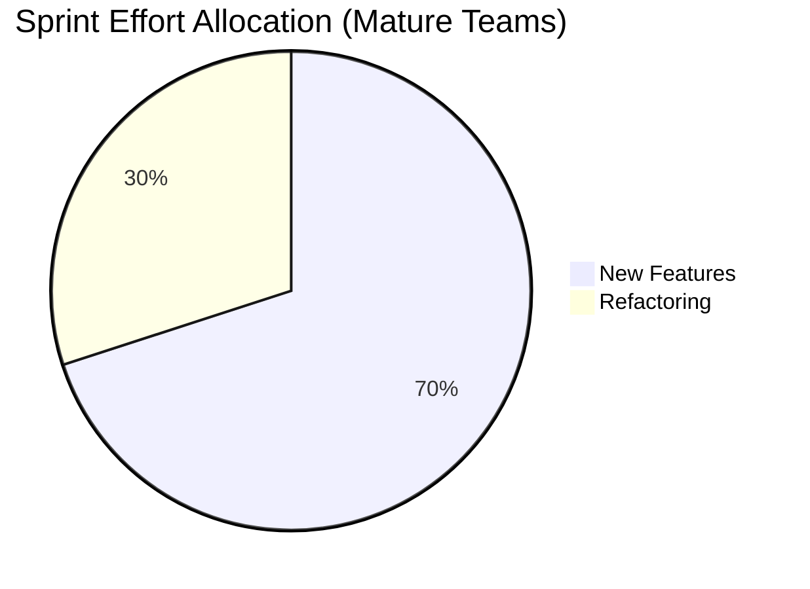

### Testing & Automation

Once you start with the CI/CD pipeline, you quickly understand that to go very fast you have to execute several thousand test cases in seconds or minutes rather than days and weeks.

Having short iteration time means you can deliver very small changes, making it easier to follow progress, test, and isolate errors. Time to market is much lower when you can deploy several times a day rather than a few times a year.

### Architecture Diagrams

Diagrams are important for understanding architecture. You have to be aware of the perspective:

- **Request flow model** — how a request moves through the system at runtime
- **Dependency perspective** — which components depend on which at compile-time

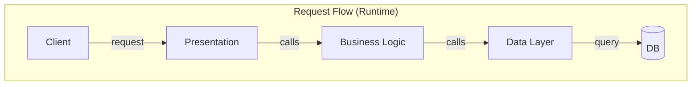

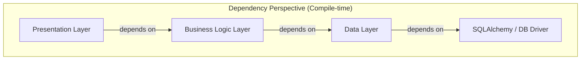

### Project Handover & Maintenance

A project has a beginning and an end, but the rest of the world does not. Someone will always inherit the project and maintain it afterward. This handover to maintenance is a crucial step, and it is wise to start this process very early in the project phases to gain buy-in and understanding from those who will maintain it.

The ratio between the initial project and later stages is roughly one third in the project and two thirds in later stages — most of the application is actually not done when handed over to maintenance.

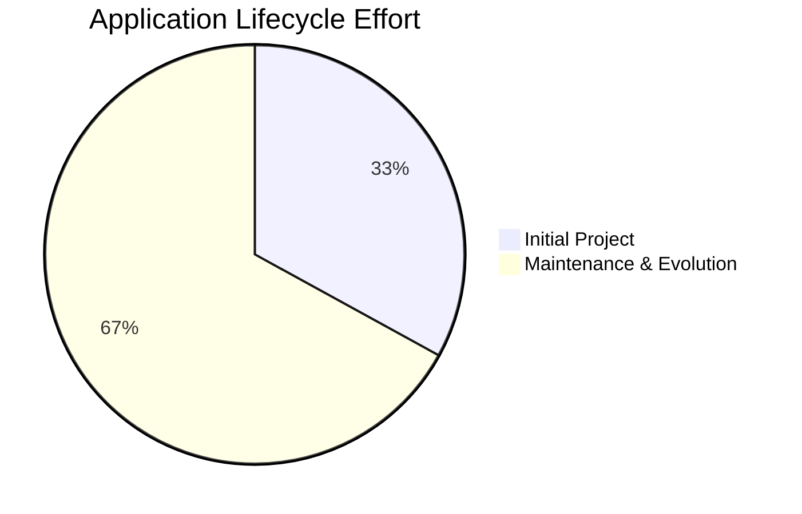

```mermaid
graph LR
    PROJ[Project Phase] -->|handover| MAINT[Maintenance Phase]

    EARLY[Start Handover<br/>Early!] -.->|build understanding| MAINT
    MAINT -->|continues| LIFE[Application<br/>Lifetime]

    style EARLY fill:#3a2a0c,stroke:#FECC00
```

### Organizational Impact

All technical implementations by design will affect the organization that receives them. Without understanding the impact on the receiving organization, many times that organization will refuse to adopt the solution, even if the application itself is very good.

### AI in Development

The inner loop previously done by developers manually has now been augmented by AI coding agents. The clear automation part previously was the CI/CD pipeline and infrastructure provisioning. Now the inner loop has also been accelerated, where sprints can be carried out with ever-increasing velocity with the help of AI coding agents.

This will dramatically change the way you operate as a project manager. Developers will have AI colleagues that are extremely fast at generating code. What remains critically important is to keep the architecture and security aspects sound — developers must understand the implications of different architectural choices and ensure everything remains safe.

```mermaid
graph TD
    subgraph "Before AI"
        B1[Manual Coding] --> B2[CI/CD Automation] --> B3[Infra Automation]
    end

    subgraph "With AI Agents"
        A1[AI-Augmented Coding] --> A2[CI/CD Automation] --> A3[Infra Automation]
    end

    A1 -.->|"increased velocity"| A1
    CRITICAL[Still Critical:<br/>Architecture & Security] -.-> A1

    style CRITICAL fill:#3a2a0c,stroke:#FECC00
    style A1 fill:#0a2a1c,stroke:#00D9FF
```

### Cloud Providers

We have used Azure as an example, but the three big providers are Azure, AWS, and Google Cloud Platform. In certain instances there might be interesting smaller alternatives like Cloudflare, Netlify, or Vercel. The concepts are transferable across providers.

### Infrastructure: Previous Course vs. This Course

In the previous course (SNS), we had infrastructure as a three-tier layered architecture mainly for security reasons. Here in the ASD course, when we created the Python Flask application, we also have a three-tier architecture — but this time it is an application architecture pattern for separation of concerns, maintainability, and collaboration.

```mermaid
graph TD
    subgraph SNS["SNS — Infrastructure Three-Tier"]
        S1[Public Subnet<br/>Web Server / nginx]
        S2[Private Subnet<br/>Application Server]
        S3[Database Subnet<br/>PostgreSQL]
        S1 --> S2 --> S3
    end

    subgraph ASD["ASD — Application Three-Tier"]
        A1[Presentation Layer<br/>Routes, Templates]
        A2[Business Logic Layer<br/>Services]
        A3[Data Layer<br/>Repository, ORM]
        A1 --> A2 --> A3
    end

    SNS -.->|"Purpose: Security"| SNS
    ASD -.->|"Purpose: Separation<br/>of Concerns"| ASD

    style SNS fill:#1a3a5c,stroke:#0090E3
    style ASD fill:#0a2a1c,stroke:#00D9FF
```
