# Architecture Overview
## C4 Model - Level 1: System Context

This document provides the highest level view of the Webinar Registration Website system, showing how it fits into the broader environment of users and external systems.

---

## System Context Diagram

```mermaid
flowchart LR
    subgraph actors [" "]
        attendee["👤 Event Attendee<br/><i>Registers for webinars</i>"]
        admin["👤 Marketing Administrator<br/><i>Views registrations</i>"]
        sysadmin["👤 System Administrator<br/><i>Deploys and maintains</i>"]
    end

    system[["🖥️ Webinar Registration Website<br/><i>Allows attendees to register for webinars<br/>and administrators to manage events</i>"]]

    attendee -->|HTTPS| system
    admin -->|HTTPS| system
    sysadmin -->|SSH| system

    style system fill:#438DD5,stroke:#2E6295,color:#fff
    style attendee fill:#08427B,stroke:#052E56,color:#fff
    style admin fill:#08427B,stroke:#052E56,color:#fff
    style sysadmin fill:#08427B,stroke:#052E56,color:#fff
    style actors fill:transparent,stroke:transparent
```

---

## Context Description

### The System

**Webinar Registration Website** is a web application that:
- Provides a public-facing registration form for upcoming webinars
- Stores registration data persistently
- Allows marketing staff to view who has registered
- Runs entirely on Azure infrastructure (IaaS approach)
- Includes the web frontend (HTML/CSS/JS rendered in user's browser)

### Users (Actors)

| Actor | Description | Interaction |
|-------|-------------|-------------|
| **Event Attendee** | External users (potential customers, partners) who discover the webinar through marketing channels | Register for webinars via browser (HTTPS) |
| **Marketing Administrator** | CM Corp internal staff responsible for managing webinar events | View registration lists via browser (HTTPS) |
| **System Administrator** | IT operations staff responsible for infrastructure | Deploy, configure, and maintain via terminal (SSH) |

---

## Key Architectural Decisions

1. **Pure IaaS Approach**: Traditional infrastructure model using self-managed VMs available on Azure
2. **Python Flask**: Lightweight web framework with Jinja2 templating (SSR) and SQLAlchemy ORM
3. **PostgreSQL**: Robust open-source relational database, available as PaaS on Azure (Flexible Server)
4. **SSL/TLS Encryption**: Trusted certificates freely available via Let's Encrypt with automated renewal
5. **No External Identity Provider**: Simple application without authentication requirements for attendee registration

---

## Quality Attributes

From the PRD, the key non-functional requirements affecting architecture:

| Attribute | Requirement | Impact |
|-----------|-------------|--------|
| **Availability** | ≥99% uptime during business hours | Single VM design acceptable for MVP |
| **Response Time** | Pages load < 3 seconds on broadband | Nginx caching, optimized queries |
| **Capacity** | Support 100 concurrent users | Single app server sufficient |
| **Security** | HTTPS only, OWASP guidelines | SSL termination at proxy, bastion host for SSH access, private subnets for app/data tiers, NSGs restricting traffic flow |

---

## Scope Boundary

### In Scope
- Registration form and data persistence
- Admin view of registrations  
- HTTPS encryption
- Basic health monitoring

### Out of Scope (for this stage)
- User authentication/authorization
- Email notifications
- Payment processing
- Multi-region deployment
- Auto-scaling

---

## Related Documents

- [C2-containers.md](C2-containers.md) - C4 Level 2: Container diagram showing technical building blocks
- [C3-components.md](C3-components.md) - C4 Level 3: Component breakdown of Flask application
- [../PRD.md](../PRD.md) - Product Requirements Document
- [../BRD.md](../BRD.md) - Business Requirements Document
