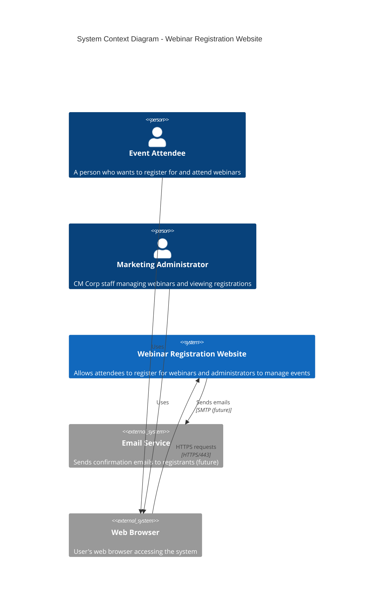

# Architecture Overview
## C4 Model - Level 1: System Context

This document provides the highest level view of the Webinar Registration Website system, showing how it fits into the broader environment of users and external systems.

---

## System Context Diagram

---

## Context Description

### The System

**Webinar Registration Website** is a web application that:
- Provides a public-facing registration form for upcoming webinars
- Stores registration data persistently
- Allows marketing staff to view who has registered
- Runs entirely on Azure infrastructure (IaaS approach)

### Users (Actors)

| Actor | Description | Interaction |
|-------|-------------|-------------|
| **Event Attendee** | External users (potential customers, partners) who discover the webinar through marketing channels | Register for webinars via web form |
| **Marketing Administrator** | CM Corp internal staff responsible for managing webinar events | View registration lists, monitor signup counts |

### External Systems

| System | Description | Integration |
|--------|-------------|-------------|
| **Web Browser** | Standard browsers (Chrome, Firefox, Safari, Edge) | HTTPS over port 443 |
| **Email Service** | Future: SMTP service for sending confirmation emails | Out of scope for MVP |

---

## Key Architectural Decisions

1. **Pure IaaS Approach**: All compute runs on self-managed VMs to demonstrate traditional infrastructure skills
2. **Azure PostgreSQL Flexible Server**: Single PaaS exception for database (pragmatic choice for managed backups/HA)
3. **Self-Signed SSL**: Acceptable for learning/demo; production would use Let's Encrypt or Azure-managed certs
4. **No External Identity Provider**: Simple application without authentication requirements for attendee registration

---

## Quality Attributes

From the PRD, the key non-functional requirements affecting architecture:

| Attribute | Requirement | Impact |
|-----------|-------------|--------|
| **Availability** | ≥99% uptime during business hours | Single VM design acceptable for MVP |
| **Response Time** | Pages load <3 seconds on broadband | Nginx caching, optimized queries |
| **Capacity** | Support 100 concurrent users | Single app server sufficient |
| **Security** | HTTPS only, OWASP guidelines | SSL termination at proxy, private subnets |

---

## Scope Boundary

### In Scope
- Registration form and data persistence
- Admin view of registrations  
- HTTPS encryption
- Basic health monitoring

### Out of Scope (for this stage)
- User authentication/authorization
- Email notifications
- Payment processing
- Multi-region deployment
- Auto-scaling

---

## Related Documents

- [containers.md](containers.md) - C4 Level 2: Container diagram showing technical building blocks
- [components.md](components.md) - C4 Level 3: Component breakdown of Flask application
- [../PRD.md](../PRD.md) - Product Requirements Document
- [../BRD.md](../BRD.md) - Business Requirements Document
