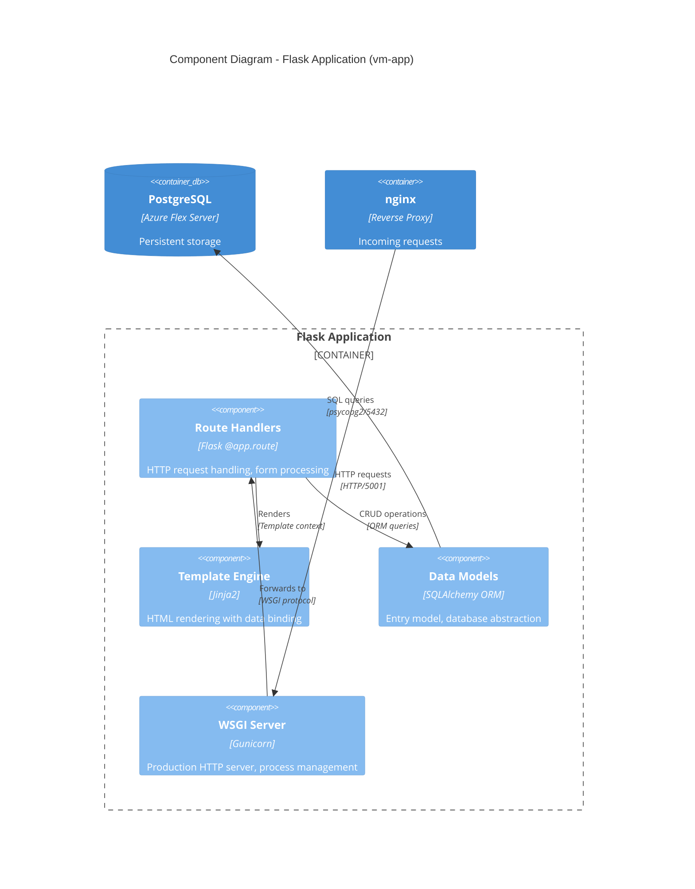

# Component Diagram
## C4 Model - Level 3: Components

This document zooms into the Flask Application container to show its internal structure and how components collaborate to fulfill the system's responsibilities.

> **Note**: For a simple Flask application like this one, a component diagram may be more detailed than strictly necessary. We include it here for educational completeness.

---

## Flask Application Components



---

## Component Inventory

### Application Components

| Component | Technology | Responsibility | Source |
|-----------|------------|----------------|--------|
| **Route Handlers** | Flask routes | Handle HTTP requests, process forms, return responses | `app.py` |
| **Template Engine** | Jinja2 | Render dynamic HTML pages | Inline in `app.py` |
| **Data Models** | SQLAlchemy | Object-relational mapping, database schema | `app.py` (Entry class) |
| **WSGI Server** | Gunicorn | Production HTTP server, worker processes | `wsgi.py` |

---

## Component Details

### 1. Route Handlers

The application exposes three HTTP endpoints:

| Route | Method | Purpose | Response |
|-------|--------|---------|----------|
| `/` | GET | Display registration form + recent entries | HTML page |
| `/` | POST | Process new registration | Redirect to GET `/` |
| `/entries` | GET | List all entries as JSON | JSON array |
| `/health` | GET | Health check for monitoring | `{"status": "ok"}` |

**Code Structure** ([app.py](../../application/app.py)):
```python
@app.route('/', methods=['GET', 'POST'])
def index():
    # POST: Create new entry
    # GET: Render form with recent entries

@app.route('/entries')
def list_entries():
    # Return all entries as JSON

@app.route('/health')
def health():
    # Health check endpoint
```

### 2. Template Engine

Uses Jinja2 (Flask's default) with inline template definition:

**Template Variables**:
| Variable | Source | Purpose |
|----------|--------|---------|
| `entries` | Query result | List of recent Entry objects |
| `count` | `Entry.query.count()` | Total number of registrations |
| `db_type` | Environment check | Shows "PostgreSQL" or "SQLite" |

**Template Features Used**:
- `` - Iteration
- `{{ entry.value }}` - Variable interpolation
- `{{ entry.created_at.strftime() }}` - Method calls
- `` - Empty state handling

### 3. Data Models

Single model representing a registration entry:

```python
class Entry(db.Model):
    __tablename__ = 'entries'
    
    id = db.Column(db.Integer, primary_key=True)
    value = db.Column(db.Text, nullable=False)     # Registrant info
    created_at = db.Column(db.DateTime, default=datetime.utcnow)
```

**Database Operations**:
| Operation | Code Pattern | SQL Equivalent |
|-----------|--------------|----------------|
| Create | `db.session.add(entry)` | INSERT INTO entries... |
| Read all | `Entry.query.all()` | SELECT * FROM entries |
| Read recent | `Entry.query.order_by(...).limit(10)` | SELECT ... ORDER BY ... LIMIT 10 |
| Count | `Entry.query.count()` | SELECT COUNT(*) FROM entries |

### 4. WSGI Server

**Entry Point** ([wsgi.py](../../application/wsgi.py)):
```python
from app import app

if __name__ == '__main__':
    app.run()
```

**Gunicorn Configuration** (via systemd unit):
```bash
gunicorn --bind 0.0.0.0:5001 wsgi:app
```

| Setting | Value | Purpose |
|---------|-------|---------|
| `--bind` | `0.0.0.0:5001` | Listen on all interfaces, port 5001 |
| Workers | 1 (default) | Single worker sufficient for small load |
| Module | `wsgi:app` | Import `app` object from `wsgi.py` |

---

## Data Flow

### Registration Flow (Happy Path)

```
1. User submits form
   POST / {value: "John Doe"}
        │
        ▼
2. Route handler receives request
   @app.route('/', methods=['POST'])
        │
        ▼
3. Create Entry object
   entry = Entry(value="John Doe")
        │
        ▼
4. Persist to database
   db.session.add(entry)
   db.session.commit()
        │
        ▼
5. Redirect to GET /
   return redirect(url_for('index'))
        │
        ▼
6. Query recent entries
   Entry.query.order_by(created_at.desc()).limit(10)
        │
        ▼
7. Render template with data
   render_template_string(INDEX_TEMPLATE, entries=entries, ...)
        │
        ▼
8. Return HTML to user
```

### Request/Response Cycle

```
┌─────────┐     ┌─────────┐     ┌─────────┐     ┌─────────┐
│ Browser │────▶│ nginx   │────▶│Gunicorn │────▶│ Flask   │
└─────────┘     └─────────┘     └─────────┘     └─────────┘
                                                     │
                    ┌────────────────────────────────┘
                    ▼
              ┌─────────┐     ┌─────────┐
              │ Model   │────▶│PostgreSQL│
              └─────────┘     └─────────┘
```

---

## Dependencies

### Python Packages ([requirements.txt](../../application/requirements.txt))

| Package | Purpose |
|---------|---------|
| `Flask` | Web framework |
| `Flask-SQLAlchemy` | ORM integration |
| `gunicorn` | Production WSGI server |
| `psycopg2-binary` | PostgreSQL driver |

### External Dependencies

| Dependency | Source | Purpose |
|------------|--------|---------|
| `DATABASE_URL` | `/etc/flask-app/app.env` | PostgreSQL connection string |
| PostgreSQL | Azure PaaS | Data persistence |
| nginx | vm-proxy | Reverse proxy, SSL |

---

## Future Evolution

For a production-ready application, this simple structure would evolve:

| Current | Production Evolution |
|---------|---------------------|
| Inline templates | Separate `templates/` directory |
| Single `app.py` | Blueprint-based modular structure |
| Inline models | Separate `models.py` |
| No validation | Form validation (WTForms) |
| No auth | Flask-Login + session management |
| Single model | Multiple models with relationships |

**Example Production Structure**:
```
application/
├── app/
│   ├── __init__.py      # App factory
│   ├── models/
│   │   ├── __init__.py
│   │   └── entry.py
│   ├── routes/
│   │   ├── __init__.py
│   │   ├── main.py
│   │   └── api.py
│   ├── templates/
│   │   ├── base.html
│   │   └── index.html
│   └── static/
├── config.py
├── wsgi.py
└── requirements.txt
```

---

## Related Documents

- [README.md](README.md) - C4 Level 1: System Context
- [containers.md](containers.md) - C4 Level 2: Container diagram
- [../../application/app.py](../../application/app.py) - Application source code
