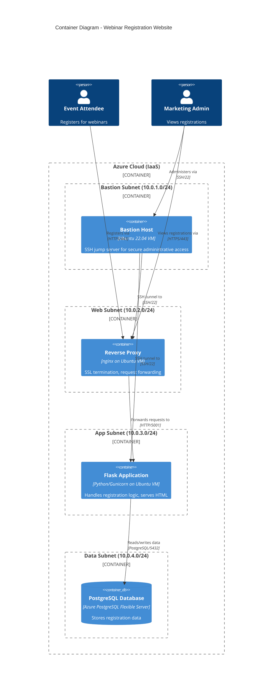

# Container Diagram
## C4 Model - Level 2: Containers

This document zooms into the Webinar Registration Website system to show the high-level technical building blocks (containers) and how they interact.

> **C4 "Container"** = A separately deployable/runnable unit (VM, application, database), NOT a Docker container.

---

## Container Diagram



---

## Container Inventory

### Compute Containers

| Container | Technology | Purpose | Network Location |
|-----------|------------|---------|------------------|
| **Bastion Host** | Ubuntu 22.04 LTS | Secure SSH entry point; no direct access to app servers from internet | `snet-bastion` (10.0.1.0/24), Public IP |
| **Reverse Proxy** | nginx on Ubuntu 22.04 | SSL termination, load balancing (future), security headers | `snet-web` (10.0.2.0/24), Public IP |
| **Flask Application** | Python 3 + Gunicorn on Ubuntu 22.04 | Business logic, HTML rendering, REST endpoints | `snet-app` (10.0.3.0/24), Private only |
| **PostgreSQL Database** | Azure PostgreSQL Flexible Server | Persistent data storage | `snet-data` (10.0.4.0/24), Private endpoint |

### Supporting Infrastructure

| Component | Purpose |
|-----------|---------|
| **Virtual Network** | `vnet-flask-bicep-dev` (10.0.0.0/16) - Network isolation |
| **NSGs** | Network Security Groups per subnet controlling traffic flow |
| **ASGs** | Application Security Groups for role-based rules |

---

## Network Flow

### User Traffic (Registration)
```
Internet → Public IP (pip-proxy) → nginx:443 → vm-app:5001 → PostgreSQL:5432
```

### Administrative Access
```
Internet → Public IP (pip-bastion) → vm-bastion:22 → (SSH tunnel) → vm-proxy/vm-app:22
```

### Security Boundaries

```
┌─────────────────────────────────────────────────────────────────────────┐
│  INTERNET                                                                │
└──────┬───────────────────────────────────────────────┬──────────────────┘
       │ SSH:22                                        │ HTTPS:443
       ▼                                               ▼
┌──────────────┐                              ┌──────────────┐
│ vm-bastion   │                              │ vm-proxy     │
│ (jump host)  │                              │ (nginx)      │
└──────┬───────┘                              └──────┬───────┘
       │ SSH:22 (internal)                           │ HTTP:5001
       ▼                                             ▼
┌────────────────────────────────────────────────────────────────────────┐
│  PRIVATE NETWORK                                                        │
│  ┌──────────────┐                          ┌──────────────────────────┐ │
│  │ vm-app       │─────PostgreSQL:5432─────▶│ PostgreSQL Flex Server   │ │
│  │ (Flask)      │                          │ (Azure PaaS)             │ │
│  └──────────────┘                          └──────────────────────────┘ │
└────────────────────────────────────────────────────────────────────────┘
```

---

## Container Details

### 1. Bastion Host (`vm-bastion`)

**Purpose**: Secure administrative access without exposing internal VMs

| Aspect | Detail |
|--------|--------|
| Image | Ubuntu 22.04 LTS |
| Size | Standard_B1s (1 vCPU, 1GB RAM) |
| Public IP | Yes (`pip-bastion`) |
| Inbound Rules | SSH (22) from Internet |
| Outbound Rules | SSH (22) to internal VMs |
| Cloud-init | [bastion.yaml](../../infrastructure/cloud-init/bastion.yaml) |

### 2. Reverse Proxy (`vm-proxy`)

**Purpose**: SSL termination, public endpoint, future load balancing

| Aspect | Detail |
|--------|--------|
| Image | Ubuntu 22.04 LTS |
| Size | Standard_B1s |
| Public IP | Yes (`pip-proxy`) |
| Software | nginx |
| SSL | Self-signed certificate (CN=flask-app) |
| Inbound Rules | HTTPS (443), HTTP (80 → redirect) |
| Outbound Rules | HTTP (5001) to app subnet |
| Cloud-init | [proxy.yaml](../../infrastructure/cloud-init/proxy.yaml) |

**nginx Configuration**:
- HTTP → HTTPS redirect (301)
- SSL with TLS 1.2/1.3 only
- Proxy headers (X-Real-IP, X-Forwarded-For, X-Forwarded-Proto)
- Upstream: `http://vm-app:5001`

### 3. Flask Application (`vm-app`)

**Purpose**: Core application logic and data access

| Aspect | Detail |
|--------|--------|
| Image | Ubuntu 22.04 LTS |
| Size | Standard_B1s |
| Public IP | **No** (security: internal only) |
| Runtime | Python 3 + Gunicorn WSGI server |
| Binding | `0.0.0.0:5001` |
| Service User | `flask-app` (system user, no login shell) |
| Inbound Rules | HTTP (5001) from web subnet only |
| Cloud-init | [app.yaml](../../infrastructure/cloud-init/app.yaml) |

**Key Files on VM**:
```
/opt/flask-app/           # Application code
/opt/flask-app/venv/      # Python virtual environment
/etc/flask-app/app.env    # DATABASE_URL (chmod 640, root:flask-app)
/etc/systemd/system/flask-app.service
```

### 4. PostgreSQL Database

**Purpose**: Persistent storage for registration data

| Aspect | Detail |
|--------|--------|
| Service | Azure Database for PostgreSQL Flexible Server |
| SKU | Burstable B1ms (1 vCPU, 2GB) |
| Version | PostgreSQL 15 |
| Access | Private endpoint in `snet-data` |
| Database | `flaskdb` |
| SSL | Required (`sslmode=require`) |

> **Note**: This is the only PaaS component. We use managed PostgreSQL for practical reasons (backups, HA, patching) while keeping compute as IaaS for learning purposes.

---

## Technology Choices

| Decision | Choice | Rationale |
|----------|--------|-----------|
| Web Server | nginx | Industry standard, excellent reverse proxy, low resource usage |
| WSGI Server | Gunicorn | Production-grade, simple configuration, works well with Flask |
| Database | PostgreSQL | Robust, open source, excellent Python support (psycopg2) |
| Process Manager | systemd | Standard on modern Ubuntu, automatic restarts, logging |
| Infrastructure | Azure Bicep | Declarative IaC, native Azure support, good learning value |

---

## Deployment Pipeline

```
┌─────────────┐    ┌─────────────┐    ┌─────────────┐
│ provision.sh│───▶│cloud-init   │───▶│ deploy.sh   │
│ (Bicep)     │    │(VMs boot)   │    │(App code)   │
└─────────────┘    └─────────────┘    └─────────────┘
     │                   │                   │
     ▼                   ▼                   ▼
 • VNet, Subnets     • Install nginx     • Copy app files
 • NSGs, ASGs        • Install Python    • Install deps
 • VMs               • Create users      • Configure DB URL
 • PostgreSQL        • Systemd units     • Start service
```

---

## Related Documents

- [README.md](README.md) - C4 Level 1: System Context
- [components.md](components.md) - C4 Level 3: Flask Application Components
- [../../infrastructure/main.bicep](../../infrastructure/main.bicep) - Infrastructure as Code
