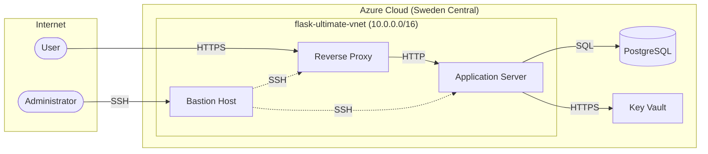
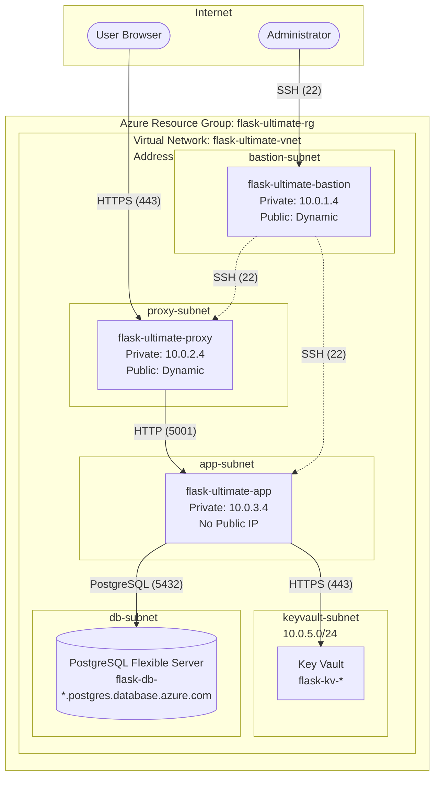
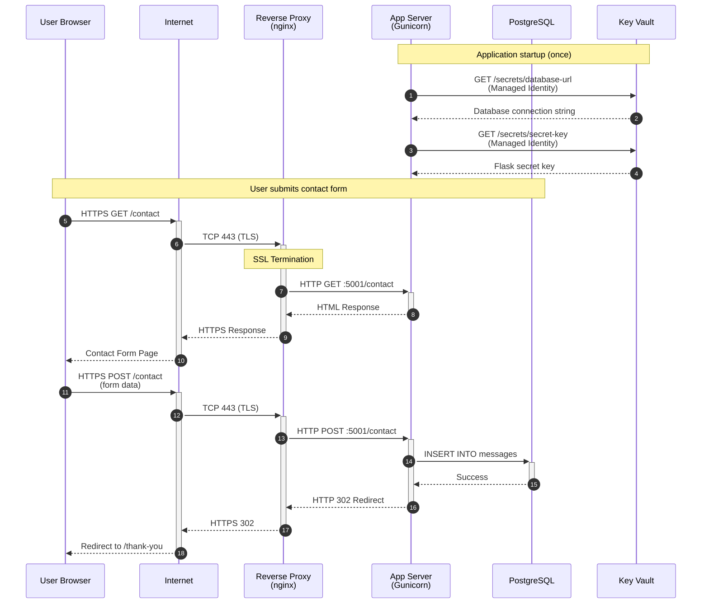
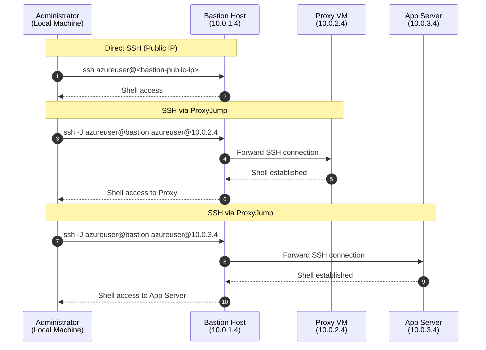
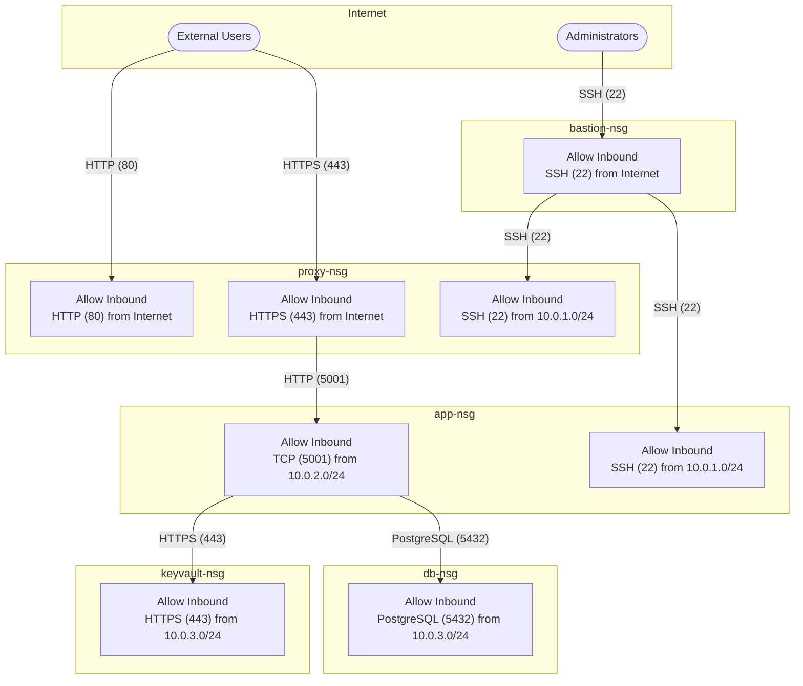
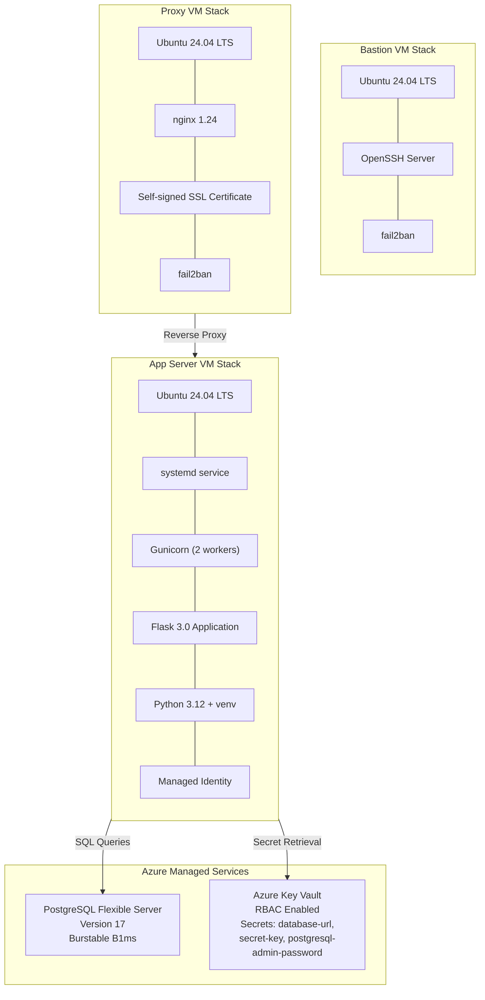
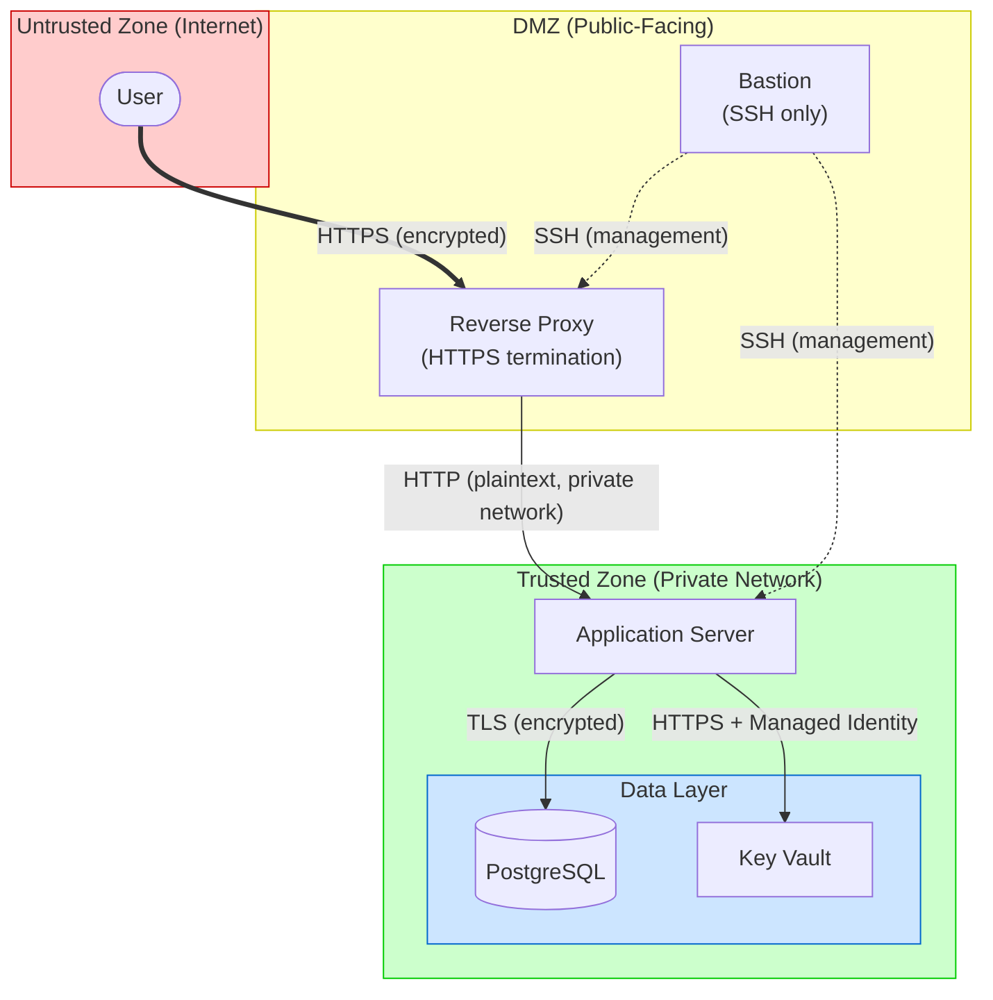
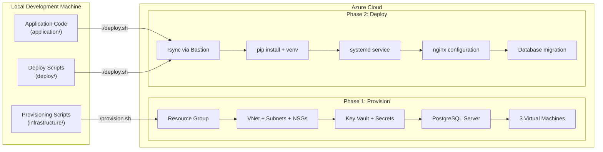
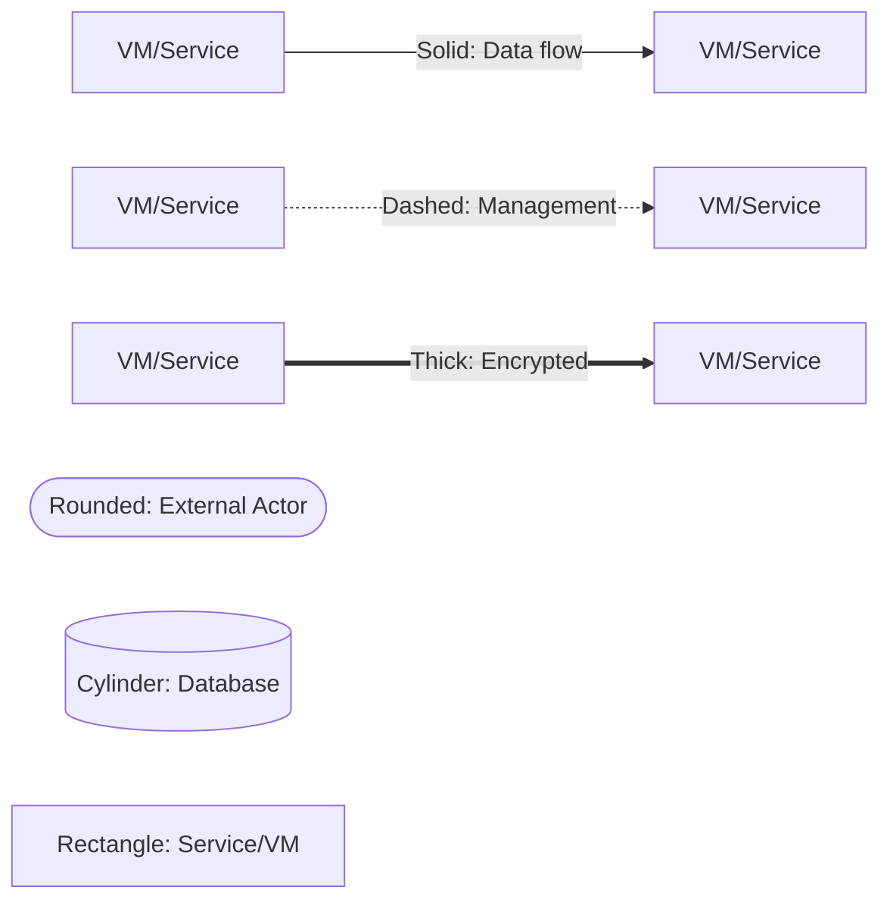

# Stage Ultimate - Architecture Documentation

This document provides visual representations of the Flask Contact Form infrastructure at different abstraction levels.

---

## 1. High-Level Overview

A simplified view showing the main components and their relationships.

---

## 2. Network Topology

Detailed view of the Virtual Network structure with subnets and IP addressing.

---

## 3. User Request Flow

Sequence diagram showing how a user request travels through the system.

---

## 4. SSH Management Flow

How administrators access the infrastructure through the bastion host.

---

## 5. Network Security Groups

Visual representation of NSG rules controlling traffic between subnets.

---

## 6. Application Component Stack

What software runs on each virtual machine.

---

## 7. Data Flow and Trust Boundaries

Shows how data flows and where security boundaries exist.

---

## 8. Deployment Pipeline

How code and configuration flow from development to production.

---

## 9. Port and Protocol Summary

| Source | Destination | Port | Protocol | Purpose |
|--------|-------------|------|----------|---------|
| Internet | Bastion | 22 | SSH | Administrator access |
| Internet | Proxy | 80 | HTTP | Redirect to HTTPS |
| Internet | Proxy | 443 | HTTPS | User web traffic |
| Bastion (10.0.1.0/24) | Proxy | 22 | SSH | Management access |
| Bastion (10.0.1.0/24) | App Server | 22 | SSH | Management access |
| Proxy (10.0.2.0/24) | App Server | 5001 | HTTP | Application traffic |
| App Server (10.0.3.0/24) | PostgreSQL | 5432 | PostgreSQL | Database queries |
| App Server (10.0.3.0/24) | Key Vault | 443 | HTTPS | Secret retrieval |

---

## 10. IP Address Reference

| Component | Private IP | Public IP | Subnet |
|-----------|------------|-----------|--------|
| Bastion VM | 10.0.1.4 | Dynamic | bastion-subnet |
| Proxy VM | 10.0.2.4 | Dynamic | proxy-subnet |
| App Server VM | 10.0.3.4 | None | app-subnet |
| PostgreSQL | N/A (PaaS) | N/A | db-subnet (logical) |
| Key Vault | N/A (PaaS) | N/A | keyvault-subnet (logical) |

---

## Diagram Legend

